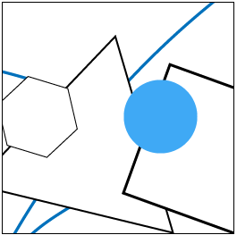

# SOS - Sea of Stuff



This is a prototype of a distributed autonomic personal data storage system.

```
      ___           ___           ___
     /  /\         /  /\         /  /\
    /  /:/_       /  /::\       /  /:/_
   /  /:/ /\     /  /:/\:\     /  /:/ /\
  /  /:/ /::\   /  /:/  \:\   /  /:/ /::\
 /__/:/ /:/\:\ /__/:/ \__\:\ /__/:/ /:/\:\
 \  \:\/:/~/:/ \  \:\ /  /:/ \  \:\/:/~/:/
  \  \::/ /:/   \  \:\  /:/   \  \::/ /:/
   \__\/ /:/     \  \:\/:/     \__\/ /:/
     /__/:/       \  \::/        /__/:/
     \__\/         \__\/         \__\/
```


## SOS Model


## SOS Architecture

WIP